# Women Connect: The Ultimate Women Entrepreneur Network (WEN) 🚀

<div align="center">
  
  <br />
  <p><strong>Empowering Women Founders through a Collaborative Professional Ecosystem.</strong></p>
  
  <a href="https://women-entrepreneur-hub-q9ox.vercel.app/">
    
  </a>
  &nbsp;
  
  &nbsp;
  
</div>

---

## 🌟 Vision & Overview
**Women Connect** is a high-end, full-stack SaaS platform designed to bridge the gap between established female founders and aspiring professional women. Unlike generic professional networks, Women Connect offers a curated, role-specific experience where every feature—from recruitment to event hosting—is tailored to the unique needs of women in business.

Built with the **MERN Stack (MongoDB, Express, React, Node)**, the platform prioritizes **High-End Aesthetics**, **Real-Time Collaboration**, and **Secure Authentication**.

---

## ✨ What Makes It Unique?
- **Role-Based Access Control (RBAC)**: A dual-sided marketplace experience for "Entrepreneurs" and "Visitors".
- **Built-in Recruitment Engine**: Seamless job posting and application tracking with PDF resume support.
- **Real-Time Community Hub**: Instant messaging powered by Socket.io for networking without delays.
- **Interactive Event Management**: Integrated video conferencing (Jitsi) and event registration tracking.
- **Zero-Latency Location Data**: Fast, local search capabilities for jobs and businesses.

---

## 🎭 User Roles & Capabilities

### 👑 The Entrepreneur (Seller/Host)
The power user role designed for business owners and administrators.
- **Business Profile**: Showcase your brand to the global community.
- **Recruitment Dashboard**: 
  - Post high-conversion job listings.
  - Review candidate profiles and download PDF resumes.
  - **Accept/Reject** applicants with real-time status updates.
- **Event Orchestration**: Host workshops and manage attendee lists.
- **Knowledge Sharing**: Publish articles to build authority in the network.

### 👩‍💻 The Visitor (Seeker/Attendee)
The community role designed for professionals and learners.
- **Career Advancement**: Browse verified female-led job openings and apply with a one-click profile.
- **Live Networking**: Participate in the Community Hub chat.
- **Lifelong Learning**: Attend hosted events and gain insights from published resources.
- **Business Following**: Stay updated with your favorite woman-led brands.

---

## 🛠 Tech Stack & Architecture

### **Frontend**
- **React.js (Vite)**: Blazing fast single-page application foundation.
- **Tailwind CSS**: Custom utility-first styling for a premium feel.
- **Framer Motion**: Smooth, cinematic transitions and micro-animations.
- **Zustand**: Clean, boilerplate-free state management.
- **Lucide Icons**: Consistent, modern iconography.

### **Backend**
- **Node.js & Express**: High-performance API architecture.
- **MongoDB & Mongoose**: Flexible, scalable data modeling.
- **Socket.io**: Persistent, bidirectional real-time communication.
- **JWT & Cookie-Parser**: Secure, HTTP-only cookie-based authentication.
- **Multer**: Robust handling for resume and image uploads.

---

## 📸 Platform Showcase (Screenshots)

<div align="center">
  <h3>🏠 Landing & Authentication</h3>
  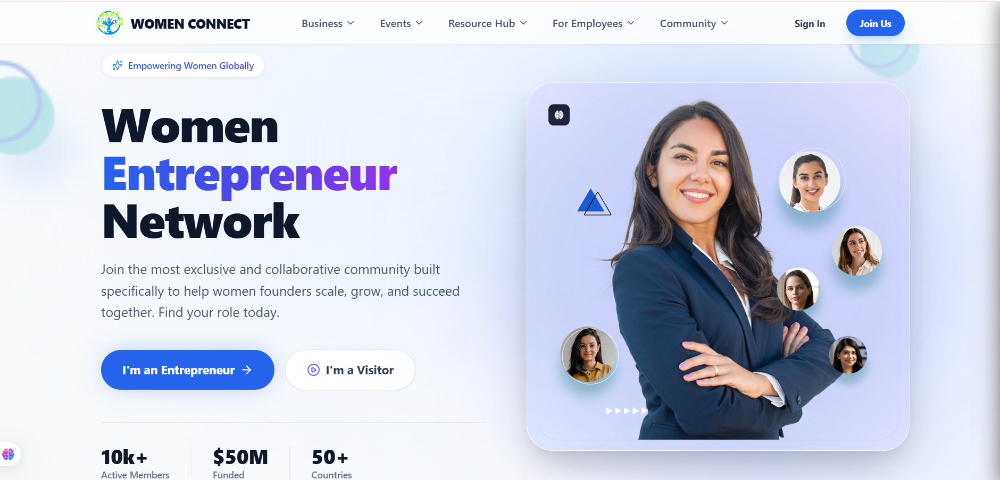
  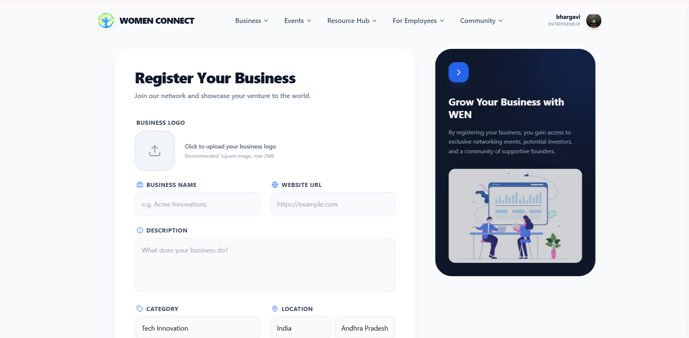
  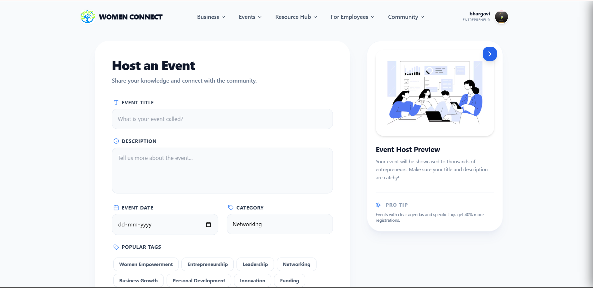
  
  <h3>💼 Business & Jobs</h3>
  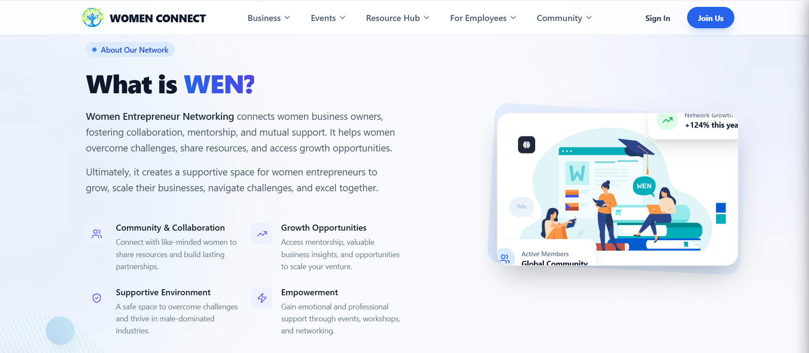
  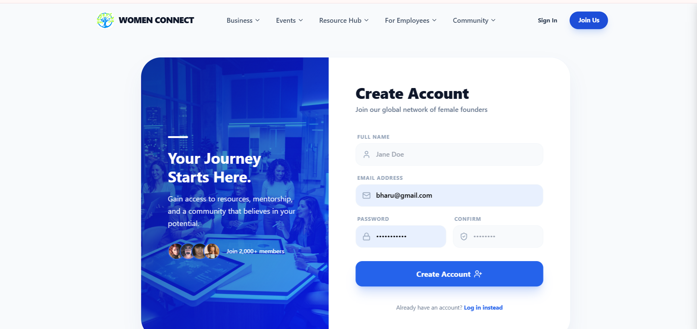
  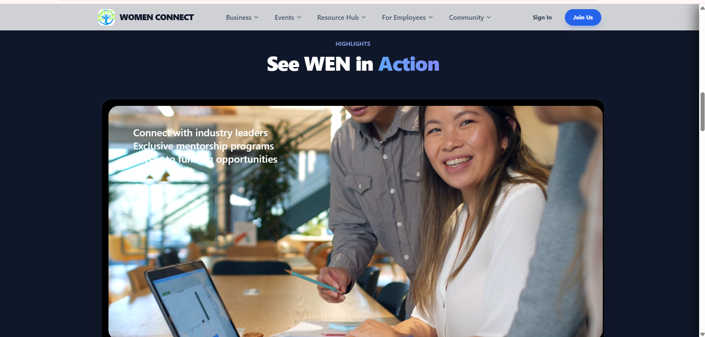
  
  <h3>🤝 Community & Events</h3>
  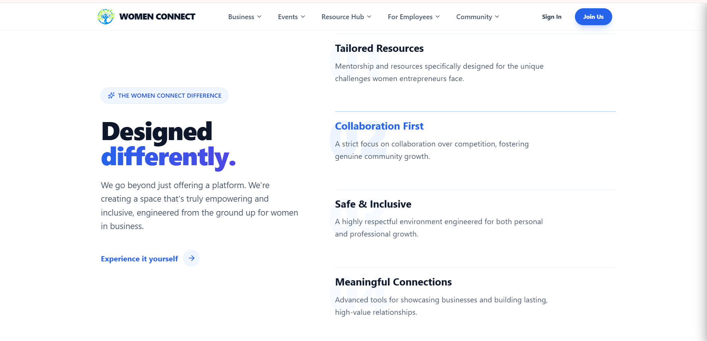
  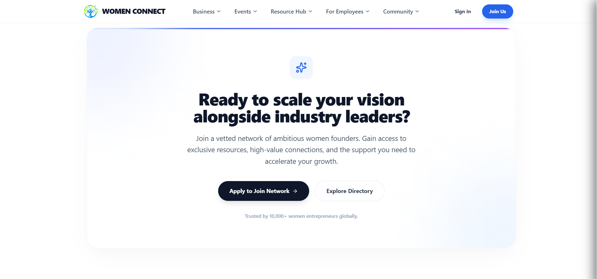
  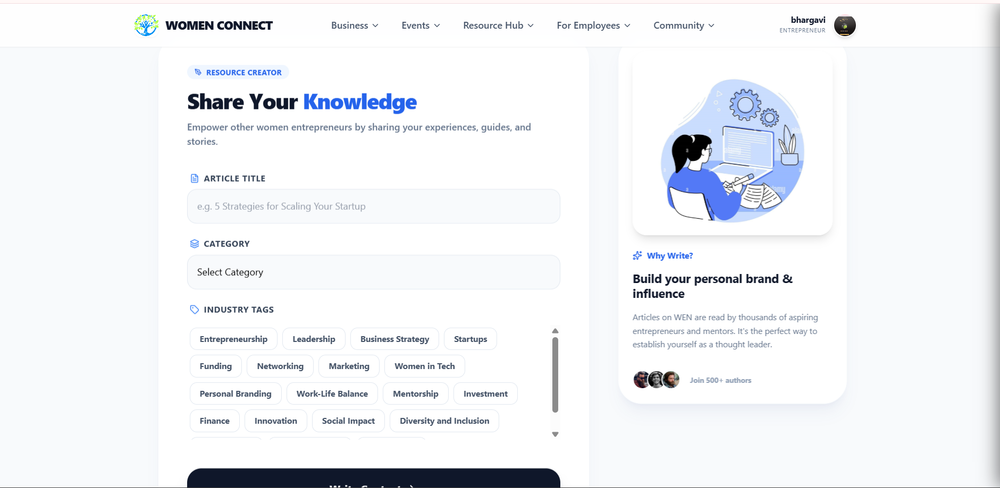
  
  <h3>📚 Resources & Profile</h3>
  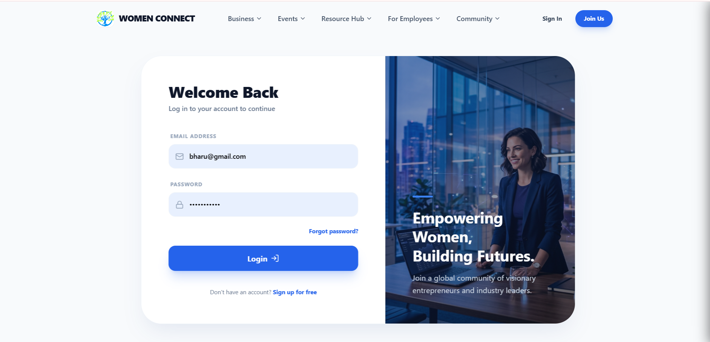
  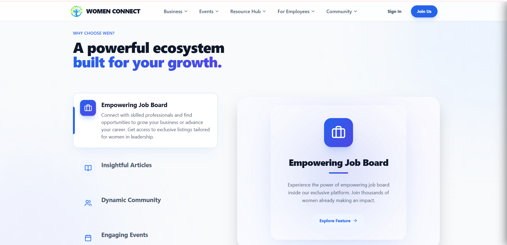
  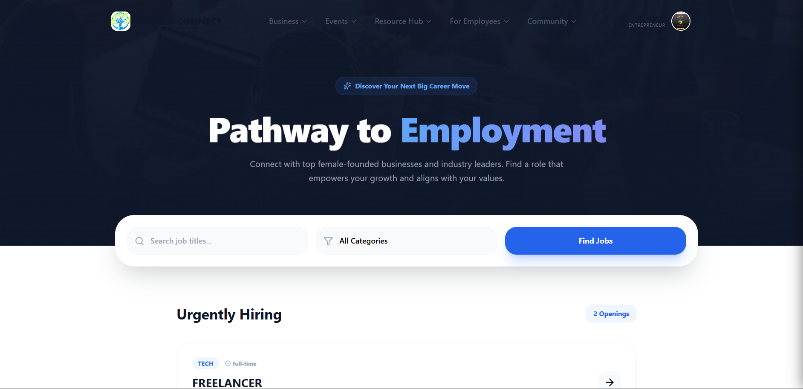

  <h3>📱 Responsive & Admin</h3>
  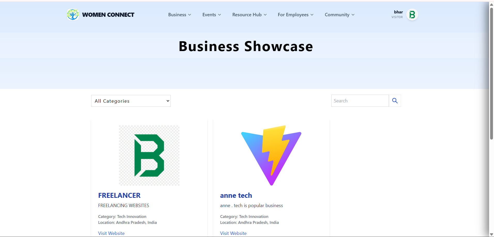
  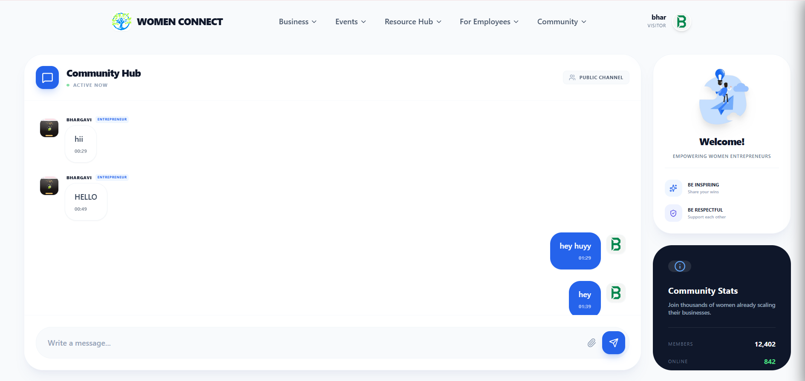
  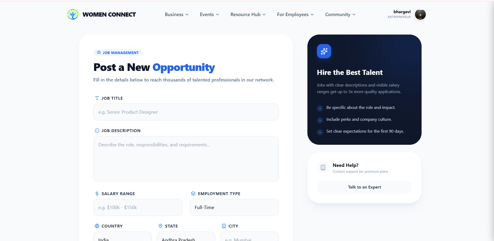
</div>

---

## 🔒 Security & RBAC
- **Authentication**: JWT tokens stored in **HTTP-only, SameSite:None, Secure** cookies to prevent XSS/CSRF.
- **Route Guards**: Custom `PrivateRoute` and `VisitorPrivateRoute` components to enforce role-based access.
- **Data Integrity**: Server-side validation using Mongoose schemas and controller-level permission checks.

---

## 🚀 Deployment & Setup

### **Live URL**
[https://women-entrepreneur-hub-q9ox.vercel.app/](https://women-entrepreneur-hub-q9ox.vercel.app/)

### **Installation**
1. **Clone & Install Dependencies**:
   ```bash
   git clone https://github.com/bhargavibattula/WomenEntrepreneurHub.git
   npm install # in both /client and /server
   ```
2. **Environment Configuration**:
   Create a `.env` in `/server` with:
   - `MONGO_URI`, `JWT_KEY`, `ORIGIN`, `PORT`.
3. **Run Locally**:
   ```bash
   npm run dev
   ```

---

## 🗺 Future Roadmap
- [ ] **1-on-1 Direct Messaging**: Private inbox for direct mentor-mentee communication.
- [ ] **Subscription Tiers**: Stripe integration for premium business features.
- [ ] **AI-Matchmaking**: Recommendation engine for jobs and events based on user skills.

---

Developed with a commitment to excellence by the **Women Connect Team**. 💖
