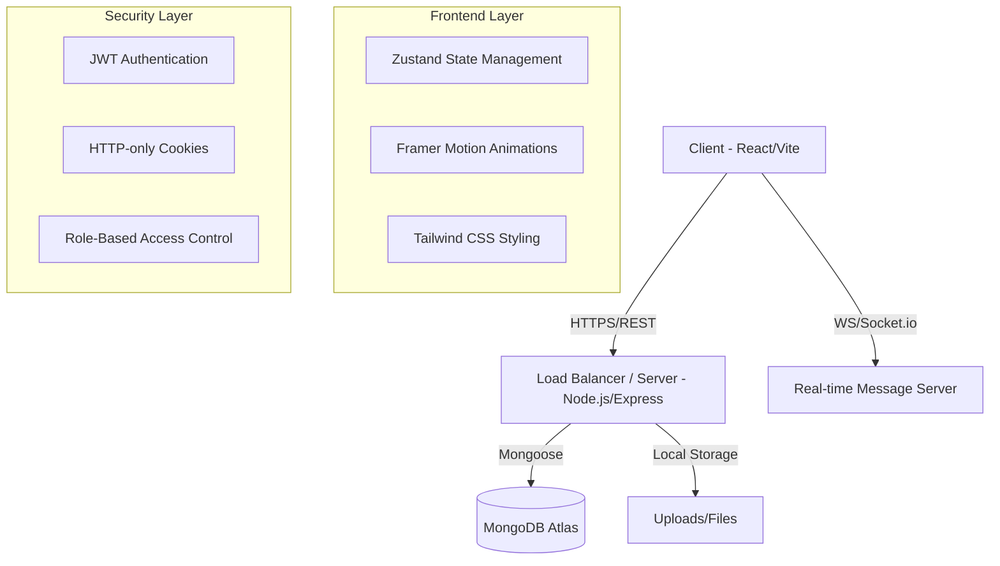

# Women Connect: Women Entrepreneur Network (WEN) 🚀

**Women Connect** is a premium, full-stack SaaS platform designed to empower women entrepreneurs by providing a collaborative ecosystem for business management, recruitment, event hosting, and community networking. 

Built with the **MERN stack** and a focus on **High-End Aesthetics**, this platform serves as a bridge between established female founders and aspiring professional women.

---

## 🌟 Unique Value Proposition
What makes **Women Connect** different?
- **Role-Specific Ecosystem**: Unlike generic business tools, Women Connect creates distinct experiences for "Entrepreneurs" (Sellers/Hosts) and "Visitors" (Seekers/Attendees).
- **Recruitment Focused**: A built-in job board where female-led startups can find talent specifically within the community.
- **Real-time Collaboration**: Integrated community chat and live event integration (Jitsi) for immediate networking.
- **Premium Design System**: A state-of-the-art UI/UX built with Tailwind CSS, Framer Motion, and Lucide icons, making professional management feel elegant.

---

## 🎭 User Roles & Features

### 👩‍💼 For Entrepreneurs (Founders & Admins)
The "Engine" of the community. Entrepreneurs have full management capabilities:
- **Business Dashboard**: Create and showcase their business profile to the entire network.
- **Recruitment Suite**: 
    - Post job opportunities.
    - View candidate profiles (Education, Experience).
    - Review uploaded PDF resumes.
    - **Accept/Reject** applications with real-time status updates.
- **Event Hosting**: 
    - Organize upcoming workshops, webinars, or retreats.
    - Manage attendee lists and track event history.
- **Resource Hub**: Share expertise by publishing articles and success stories.

### 👩‍💻 For Visitors (Members & Aspiring Professionals)
The "Community" of the network. Visitors focus on growth and contribution:
- **Career Growth**: Browse job openings from verified female-led businesses and apply with a professional candidate profile.
- **Networking**: Join the **Community Hub** to chat in real-time, ask for help, and share insights.
- **Learning**: Attend hosted events and read articles published by industry leaders.
- **Direct Support**: Register for events and follow business profiles.

---

## 🏗 Architecture & Flow

### System Architecture
The platform follows a modern **Monolithic API with a Decoupled Frontend** architecture.



### Application Flow
1. **Authentication**: Users register and verify their email. JWT is stored in HTTP-only cookies for maximum security.
2. **Onboarding**: Users choose their role (Entrepreneur or Visitor), which dynamically unlocks features.
3. **Engagement**: 
    - Entrepreneurs create content (Jobs/Events).
    - Visitors consume and interact (Apply/Register).
4. **Real-time**: Socket.io handles instant message delivery in the Community Chat.

---

## 🛠 Tech Stack

**Frontend:**
- **React.js (Vite)**: For a blazing-fast SPA experience.
- **Tailwind CSS**: For custom, premium UI components.
- **Framer Motion**: For fluid, professional animations.
- **Zustand**: Lightweight and scalable state management.
- **Lucide & React Icons**: For clean, modern iconography.

**Backend:**
- **Node.js & Express**: Robust and scalable API foundation.
- **MongoDB & Mongoose**: Flexible NoSQL schema design.
- **Socket.io**: Real-time bidirectional communication.
- **JWT**: Secure, stateless authentication.
- **Multer**: Handling file uploads (Resumes & Profile Images).

---

## 🚀 Local Setup Instructions

Follow these steps to get the project running on your machine.

### Prerequisites
- Node.js (v16 or higher)
- MongoDB (Local or Atlas URI)
- npm or yarn

### 1. Clone the Repository
```bash
git clone https://github.com/bhargavibattula/WomenEntrepreneurHub.git
cd WomenEntrepreneurHub
```

### 2. Backend Setup
```bash
cd server
npm install
```
Create a `.env` file in the `server` directory:
```env
PORT=8747
MONGO_URI=your_mongodb_uri
JWT_KEY=your_secret_key
ORIGIN=http://localhost:5173
```
Start the server:
```bash
npm run dev
```

### 3. Frontend Setup
```bash
cd ../client
npm install
```
Start the client:
```bash
npm run dev
```

The application should now be running at `http://localhost:5173`.

---

## 📑 Feature Documentation

### **Authentication System**
Uses **HTTP-only Cookies** to store JWT tokens, preventing XSS attacks. Includes email verification and a role-based setup process.

### **Recruitment Management**
Full CRUD for job posts. Includes a candidate tracking system where owners can review resumes (using Multer for storage) and manage application statuses.

### **Community Chat**
Powered by **Socket.io**. Messages are persisted in MongoDB and delivered instantly to all connected users. Supports role-based identification within chat bubbles...

### **Responsive Engine**
Custom Tailwind breakpoints ensure that complex management dashboards stack elegantly on mobile while utilizing the full 1600px width on ultra-wide monitors.

---

## 🗺 Future Roadmap
- [ ] **Direct Messaging**: 1-on-1 private chats between entrepreneurs and applicants.
- [ ] **Payment Integration**: Secure subscription tiers for premium features.
- [ ] **AI-Matchmaking**: AI-driven job and event recommendations.

---

Built with ❤️ for the **Women Entrepreneur Network**.
